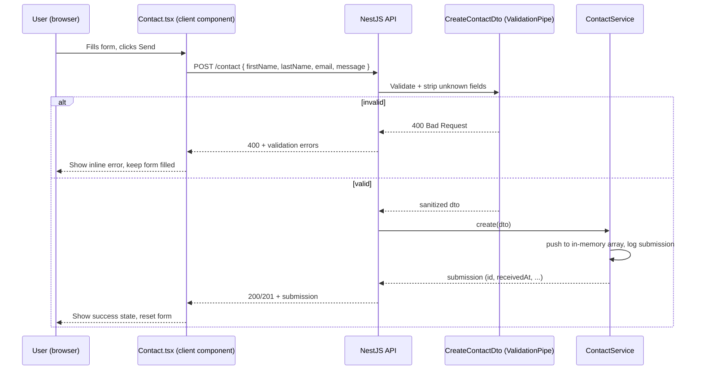

# AI47 Labs — Architecture

This document describes how the two halves of the project (`frontend/` and
`backend/`) are put together, how data flows between them, and where the
natural extension points are for anyone picking this up later.

## 1. System overview

The project is a classic decoupled web app: a static-first Next.js frontend
that renders the marketing site, and a small NestJS API that the frontend
talks to for one thing only — the contact form. Everything else on the site
(copy, product cards, FAQs, blog links) is static content bundled at build
time; there's no CMS and no database read path.


### 2.2 Rendering model

The whole marketing site is a **single route** (`/`). `AppShell` wraps every
section and uses `useActiveSection` to watch section `id`s (`home`, `about`,
`products`, `capabilities`, `blog`, `faq`, `contact`) via
`IntersectionObserver`; whichever section is in view drives the highlighted
item in the sidebar/topbar. There's no server-side data fetching — every
section is a static server component except the interactive ones
(`Contact`, theme toggle, sidebar) which are explicitly marked
`"use client"`.

### 2.3 Data flow

`lib/data.ts` is imported directly by section components — there's no prop
drilling or global store. Changing copy, a product's link/logo, an office
address, or the blog post list means editing one file and every consumer
re-renders with the new data at build time.

### 2.4 External content, not a CMS

Two categories of content are intentionally **not** owned by this repo:

- **Blog** — cards in the `Blog` section link straight out
  (`target="_blank"`) to the real, live articles on `ai47labs.com/blogs/…`.
  There's no internal `/blog` route or duplicated article content; this
  repo just displays a curated preview with real thumbnails and dates.
- **Logo** — the AI47Labs brand mark is fetched from
  `ai47labs.com/wp-content/uploads/...` at request time (via `next/image`,
  whitelisted in `next.config.mjs`) and reused everywhere a site
  conventionally shows its logo: sidebar, topbar, footer, the About-section
  badge, the browser favicon, and the Open Graph/Twitter share image.

### 2.5 Styling & theming

Tailwind utility classes throughout, with a small CSS-variable theme
(`globals.css`) so `next-themes` can flip between light/dark without a
repaint flash. Each card grid (products, capabilities, blog) cycles through
a shared `accentPalette` from `lib/data.ts` so every card gets a distinct
color without hardcoding hex values per component.

### 2.6 Animation

Built with the `motion` package (already a dependency, no extra install
needed): cards fade/slide in on scroll (`whileInView`, staggered by index)
and lift on hover (`whileHover`). This replaced an earlier mouse-tracking
glow effect that produced visual glitches on an uneven grid — the current
approach only needs viewport/hover state, so it can't get stuck mid-render.

## 3. Backend architecture (`backend/`)

**Stack:** NestJS + TypeScript, `class-validator` / `class-transformer` for
request validation.

```
backend/
└── src/
    ├── main.ts                 Bootstraps Nest, enables CORS (origin from
    │                           FRONTEND_URL env var) and a global
    │                           ValidationPipe ({ whitelist: true, transform: true })
    ├── app.module.ts           Root module — imports ContactModule
    ├── app.controller.ts       GET /health
    ├── app.service.ts
    └── contact/
        ├── contact.module.ts
        ├── contact.controller.ts   POST /contact (create), GET /contact (list)
        ├── contact.service.ts      In-memory array store + logger
        └── dto/create-contact.dto.ts   firstName, lastName, email, message
                                          — validated via class-validator
```

### 3.1 Request lifecycle (contact form submit)



### 3.2 Persistence — current state vs. intended extension point

`ContactService` currently holds submissions in a plain in-memory array
(`private submissions: ContactSubmission[]`), which is fine for local dev
and demoing but **resets on every server restart and doesn't scale past one
process**. The code comments mark exactly where this should be swapped out:

- Replace the array with a repository backed by **PostgreSQL** (e.g.
  TypeORM/Prisma) or **MongoDB** (Mongoose), keyed on the same
  `ContactSubmission` shape.
- Forward each submission to an email provider (Resend, SES, Postmark) so
  the team is notified in real time instead of having to poll `GET
  /contact`.
- `GET /contact` currently returns every submission with no auth — it's
  explicitly commented as a local-dev convenience and should be removed or
  put behind auth before any real deployment.

### 3.3 Validation

All request validation lives in `CreateContactDto` via decorators
(`@IsNotEmpty`, `@IsEmail`, `@MinLength`, `@MaxLength`). The global
`ValidationPipe` in `main.ts` enforces these automatically and strips any
field not declared on the DTO (`whitelist: true`), so the controller layer
never has to hand-check input.

## 4. Environment & configuration

| Variable | Used by | Default | Purpose |
|---|---|---|---|
| `NEXT_PUBLIC_API_URL` | frontend | `http://localhost:3001` | Base URL the contact form fetches against |
| `FRONTEND_URL` | backend | `http://localhost:3000` | Allowed CORS origin |
| `PORT` | backend | `3001` | API listen port |

## 5. Local development

```bash
# backend
cd backend
npm install
npm run start:dev        # http://localhost:3001

# frontend (separate terminal)
cd frontend
npm install
cp .env.local.example .env.local
npm run dev               # http://localhost:3000
```

## 6. Suggested next steps for a production deployment

These are recommendations, not things already wired up in the repo:

1. **Database-backed contact storage** — swap the in-memory array for
   Postgres or MongoDB as noted in §3.2.
2. **Auth-protect or remove `GET /contact`** before deploying anywhere
   public.
3. **Rate-limit `POST /contact`** to prevent spam submissions.
4. **Split hosting**: frontend deploys cleanly to Vercel (it's a standard
   Next.js App Router project); backend can go to any Node host (Railway,
   Render, Fly.io) — just set `FRONTEND_URL` and `NEXT_PUBLIC_API_URL` to
   the deployed URLs on each side.
5. **Image domains**: if the real AI47Labs logo or blog images ever move
   off `ai47labs.com`, update the `remotePatterns` in `next.config.mjs` to
   match, or `next/image` will refuse to load them.